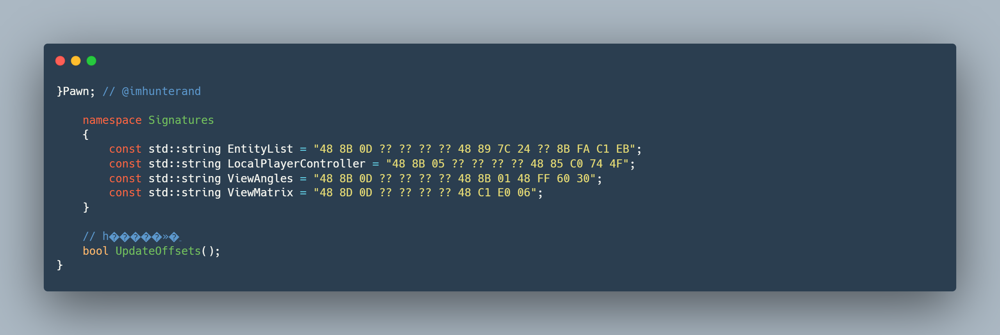

<p align="left">

</a>

```diff
+	inline DWORD EntityList;// = 0x178C878;
-	inline DWORD Matrix;// = 0x187A6D0;
-	inline DWORD ViewAngle;// = 0x18D9590;
+	inline DWORD LocalPlayerController;// = 0x17DB0F8;
```

# CS2UpOffsets
Functions of CS2 Source Project
 - BoneESP
 - BoxESP
 - Health Bar
 - Aimbot (Fov 1 - 100%)
 - EyeLine
 - Auto Fix Offests
 - Timer Bom Exploit (I not recommended to use this)


# Cara Menggunakan Project CS2
Untuk mengkompilasi cheat, ikuti langkah-langkah sederhana ini. Namun, kami tidak dapat menjamin bahwa cara ini akan berhasil untuk semua orang, karena sistem dan perangkat lunak berbeda-beda. Anda mungkin perlu menyesuaikan panduan ini berdasarkan konfigurasi sistem Anda.
 - **Install Visual Studio:** Agar cheat berfungsi, Anda harus mengkompilasi kode sumbernya menggunakan Visual Studio, yang dapat diunduh dari situs resmi Microsoft.
```
git clone --depth=1 https://github.com/imhunterand/CS2UpOffsets.git
```
   
 - **Open Project:** Setelah VS terinstall buka proyek sumber source dengan membuka file solusi utama.
 - **Konfigurasikan Folder Project:** Verifikasi konfigurasi build dan pastikan sesuai dengan persyaratan sumber source.
 - **Build the Project:** Pilih opsi build di Visual Studio untuk mengkompilasi proyek. Ini akan menghasilkan file yang dapat dieksekusi berdasarkan kode source.
 - **Debug and Test:** Utamakan testing terlebih dahulu agar tidak mengalami kerusakan ataupun error, Alat debugging di Visual Studio dapat membantu Anda mengidentifikasi kesalahan dan bug dalam proyek selama proses kompilasi.

**Catatan:** source ini dimaksudkan untuk mempelajari struktur offset game dan mempelajari cara mengembangkan exploits untuk game Counter-Strike 2.
